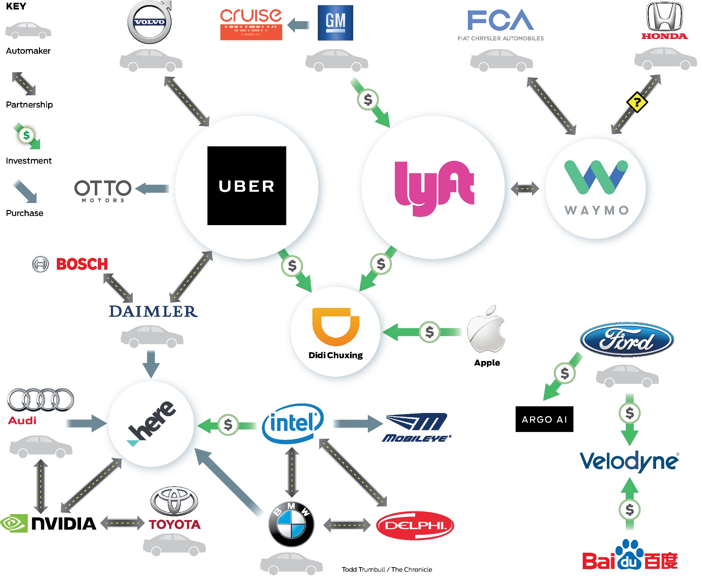

# Contributing 
This is a curated list of resources on self-driving car. Please send a Pull Request, if you 
want to add more awesome resources. 

# Content
## Companies involved in self-driving

## Competitions
We start with competitions, as we firmly believe in 
[problem-based-learning](https://en.wikipedia.org/wiki/Problem-based_learning)
* [MIT course on self-driving course](http://selfdrivingcars.mit.edu/) 
   * [DeepTraffic](http://selfdrivingcars.mit.edu/deeptraffic/)
   * [DeepTesla](http://selfdrivingcars.mit.edu/deeptesla/)
* [Udacity DIDI Challenge](https://challenge.udacity.com/)
* [Udacity open self-driving car challenge](https://www.udacity.com/self-driving-car)
* [German Traffic Sign Challenge](http://benchmark.ini.rub.de/?section=gtsdb&subsection=dataset)

## Relevant Courses 
* [Self-driving NanoDegree with Udacity](https://www.udacity.com/course/self-driving-car-engineer-nanodegree--nd013)
* [MIT course on self-driving course](http://selfdrivingcars.mit.edu/)
* [Deep learning with Udacity(Google)](https://www.udacity.com/course/deep-learning--ud730)

## Video Talks 
* [Cruise's Peter Gao talks about self-driving](https://www.youtube.com/watch?v=s-8cYj_eh8E)
* [AI By the Bay](https://www.youtube.com/playlist?list=PLNESult6cnOk3Q8tjfSIWy49Fz37l0wZU)
    * [George Hotz on current state of self-driving](https://www.youtube.com/watch?v=IxuU5L2MEII)

## GitHub Assignments 
* [Deep Learning with Udacity (Google) assignments](https://github.com/rndbrtrnd/udacity-deep-learning) 
* [Udacity's Self-driving car assignments](https://github.com/jessicayung/self-driving-car-nd)

## Miscellaneous
* [Comma.ai's steering angle predictor with data](https://github.com/commaai/research)
* [Comma.ai's open-source driving agent](https://github.com/commaai/openpilot)
* [Medium Post by David Silver](https://medium.com/@dsilver829)
* [Lex Fridman's Research page on Semi-autonomous vehicle](http://lexfridman.com/)
* [Nvidia's Automotive Solution](http://www.nvidia.com/object/drive-px.html)
    * [Nvidia Drive Px 2]() extends Palm-sized Auto-cruise module to autonomous driving capabilities.
      Supercomputer for AI car. 
    * [Nvidia DriveWorks](): SDK for Object detection, map localization and path planning.
    * [Nvidia DGX-1](): Tesla v80 architecture (3x faster)
    * [Nvidia MapWorks](): End to end HD mapping
    * [Nvidia Co-pilot](): AI Copilot
    * [Advanced Drive Assistance System](): ADAS. discern a police car from a taxi; an ambulance from a delivery 
    truck; or a parked car from one that is about to pull out into traffic.
 