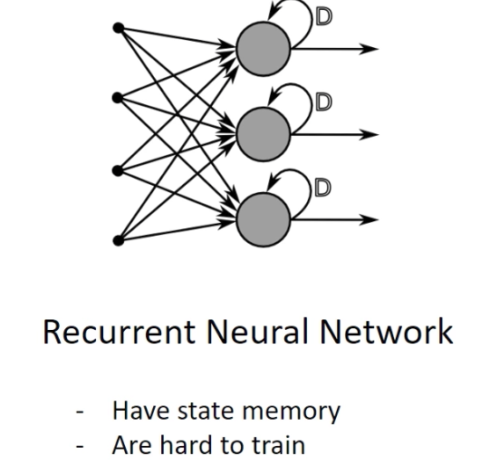

* Types of Machine Learning
    * Supervised Learning  
    * Unsupervised Learning 
    * Semi-supervised Learning
        * Reinforcement Learning: That's how human learn. Every once in a while agent receive the reward. 

* Perceptron's output is discrete and this makes it very sensitive to change in input values. 
* Neuron = Percetron + Activation Function 
* Two types of networks 
    * Feed-forward Neural Networks 
    * Recurrent Neural Networks 
    
    
   

      
* Supervised learning is like a memorization. Give the set of input data and labels, it learns to
 do these tasks better. On the other hand, Reinforcement learning uses semi-supervised learning to
 understand the mechanism behind a system. And our hope is that it will be able to reason much 
 better.
* Markov Decision Process 
    * S_0, a_0, r_0, s_1, a_1, r_1, s_2, a_2, r_2 .. 
* Major Component of RL agent 
    * Policy: Agent's behavior function 
    * Value(Reward) Function : Reward corresponding to (state, action)
        * Discounted Future Rewards: R_{t} = r + Gamma * R_{t+1}                      
    * Model : Agent's Representation of the environment
* Two Approaches 
    * Monte Carlo 
    * Q-Learning  
* Exploration vs Exploitation 
    * Maintain exploration: PI(s, a) > 0 for all (s,a) 
    * Epsilon greedy policy:
       * With probability 1- Epsilon perform optimum action 
       * With probability Epsilon perform a random action
       * After enough exploration, move to greedy policy. Epsilon -> 0.
    * Change the value of alpha over time. 

* Deep Q-Learning
 

     